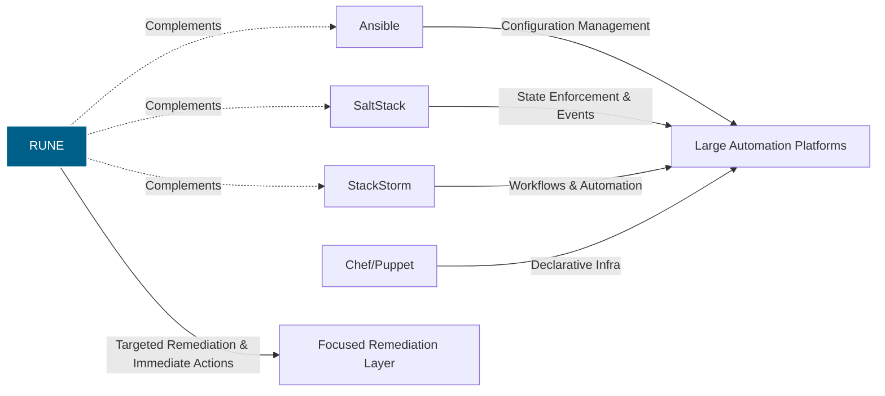

# Why RUNE?

RUNE exists to solve a gap that mainstream automation and orchestration platforms consistently overlook: **fast, reliable, structured remote remediation** without agents, daemons, or heavyweight infrastructure.

This document explains what makes RUNE unique, why it complements existing tools instead of competing with them, and how its standards-based design avoids becoming yet another proprietary "one‑off" automation system.

---

## 1. Purpose-Built for Remediation, Not Configuration

Most tools in this space were designed for one of the following:

- **Configuration management** (Ansible, Puppet, Chef)
- **State-driven orchestration** (Salt)
- **Workflow engines** (StackStorm)
- **Monitoring and alerting** (Sensu, Nagios)

RUNE is built for something different:

> When a system is failing _right now_, a human needs a safe, repeatable way to run a specific remote action and get structured results immediately.

RUNE is laser-focused on:

- Diagnostics
- Log collection
- Service restarts
- Targeted healing
- Single-node or small-scope corrective actions

No YAML DSL. No configuration drift. No multi-stage pipelines. Just **run the action**.

---

## 2. Zero-Agent Architecture

Remote hosts do **not** run RUNE.

- No daemon
- No background agent
- No bootstrapping
- No dependency installation

RUNE executes actions using:

- **SSH** (default)
- **AWS SSM** (optional for cloud nodes)

This keeps your fleet clean and minimizes blast radius. RUNE is not another moving part you have to maintain.

---

## 3. Standards-Based Protocol Design

RUNE is not a pile of shell scripts glued together. It is built on explicit, documented protocols:

### **Runtime Communication Spec (RCS)**

Defines how requests and responses are structured and routed.

### **Error Protocol Specification (EPS)**

A strict, JSON‑RPC–inspired error envelope with:

- error codes
- context
- recovery hints
- machine‑parseable structure

### **Bash Plugin Communication Spec (BPCS)**

Defines exactly how Bash plugins must:

- receive input (via JSON stdin)
- output results (structured JSON stdout)
- report errors (exit codes + EPS objects)

### **Module Registration Spec (MRS)**

Plugins can self‑describe capabilities for introspection.

These standards make RUNE:

- predictable
- testable
- observable
- extensible

And unlike many tools, none of these protocols are proprietary black boxes.

---

## 4. Simple, Replaceable Plugin Model

A RUNE plugin is just a script:

- Bash today
- Python tomorrow
- Any language that can read stdin and print JSON is fair game

There is no DSL to learn and no vendor lock‑in.

Your team already knows how to write RUNE plugins because they already know Bash.

---

## 5. Minimal Surface Area, Maximum Reliability

RUNE focuses on one thing: **remote execution with structured results**.

It is intentionally _not_ a:

- config‑management framework
- workflow engine
- cluster scheduler
- monitoring pipeline
- GitOps platform

This minimalism means:

- faster onboarding
- fewer failure modes
- cleaner logs and traces
- easier security audits

RUNE does not try to be everything — just the thing you need during incident response.

---

## 6. Designed for Both Human and Machine Users

RUNE serves two audiences:

- **Humans** running `rune run gather-logs --node host01`
- **Systems** (dashboards, alert handlers, CI/CD pipelines) calling RUNE to execute emergency actions

Its output is always structured JSON, so:

- dashboards can show results cleanly
- automation can react programmatically
- logs can be indexed and correlated

---

## 7. Plays Nicely With Existing Ecosystems

RUNE is not an Ansible replacement. It is not trying to be Salt. It does not compete with StackStorm.

It complements them:

- Use Ansible to configure your fleet
- Use Salt for reactive state enforcement
- Use StackStorm for workflows
- Use RUNE for immediate remediation and diagnostics

RUNE fills the missing middle ground.

---

## 8. What Makes RUNE Special?

### **Focused** - Only solves the problem it was born to solve

### **Portable** - Plugins are simple scripts

### **Agentless** - Zero footprint on remote nodes

### **Structured** - Everything uses known schemas and standards

### **Composable** - Easy to integrate into dashboards or pipelines

### **Predictable** - No ad‑hoc output, no guessing, no surprises

RUNE is small by design, but powerful in the exact moments you need it.

If Ansible is a Swiss Army knife and Salt is a multi‑tool—RUNE is the scalpel.

---

# Comparison Diagram: RUNE vs Other Platforms

This diagram highlights RUNE’s role as a **remediation‑layer tool**, not a config‑management competitor.

© 2025 Richard Majewski. Licensed under the MPL-2.0.
